<div align="center">

<!-- ⚡ TOP BANNER — custom glowing SVG, lives in ./assets/banner.svg ⚡ -->


<!--
  🐾 DROP YOUR OWN PIKACHU GIF HERE 🐾
  Grab a "pikachu running" GIF from Giphy/Tenor and paste its direct .gif link below.
  Example line to uncomment once you have your link:

  
-->
<p>
  
</p>


</div>

<br/>

## ⚡ About Me

```yaml
trainer:
  name: Sristi Paul
  class: ECE Undergraduate
  specialty: [Software Engineering, IoT, GenAI]
  status: "Exploring the intersection of software & hardware ⚡"
  currently: "Building projects & leveling up skills"
```

- 🔭 I love building projects that bridge **hardware + software**
- 🌱 Constantly exploring new technologies & GenAI tools
- ⚡ Powered by curiosity, caffeine, and clean code
- 📫 Reach me — see badges below!

<br clear="right"/>

## 🌐 Connect With Me

<p align="left">
<a href="https://www.linkedin.com/in/sristi-paul-530037279/" target="_blank">
  
</a>
<a href="mailto:sristi.paul.official@gmail.com">
  
</a>
</p>

## ⚙️ Tech Stack

<p align="left">
  
</p>

<details>
<summary>💠 Badge view</summary>
<br>


</details>


## 📊 GitHub Stats

<div align="center">


</div>

## 🏆 Trophy Case

<div align="center">
  
</div>

## 🐍 Contribution Snake

<div align="center">
  
</div>

## ✍️ Random Dev Quote

<div align="center">


</div>

---

<div align="center">

[](https://visitcount.itsvg.in)

<sub>⚡ Proudly leveled up with <a href="https://gprm.itsvg.in">GPRM</a> ⚡</sub>


</div>
