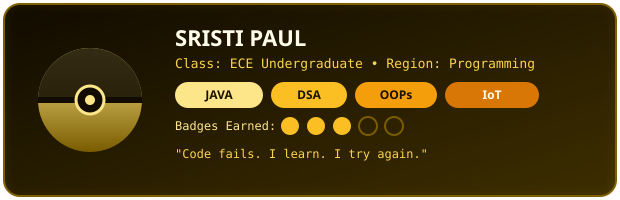
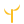
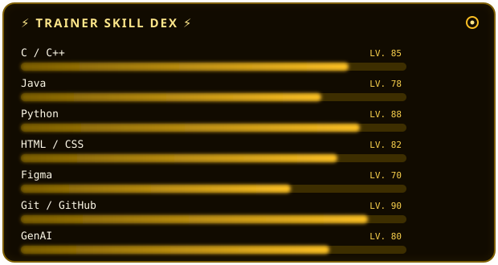
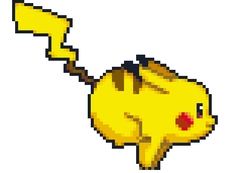
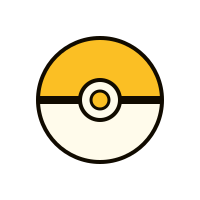

<div align="center">

<br>

</div>

##  About Me

<div align="center">

</div>

```yaml
currently: "Building projects & leveling up skills"
```

-  Continuously learning Java, C++, Python, Web Development, and GenAI
-  Experienced with tools and technologies like Git, GitHub, Figma, HTML, CSS, and JavaScript
-  Enjoy turning ideas into practical, meaningful projects
-  Value teamwork, communication, and collaborative problem-solving


##  Tech Stack

<p align="left">
  
</p>

<div align="center">

</div>

<details>
<summary>Full tech badge list</summary>
<br>


</details>

##  GitHub Stats

<div align="center">

</div>

---

<br>

<table>
<tr>
<td width="20%" align="center">

</td>
<td width="60%" align="center">

</td>
<td width="20%" align="center">

</td>
</tr>
</table>

<br>

<div align="center">

[](https://visitcount.itsvg.in)

<sub> Connect with me via <a href="https://www.linkedin.com/in/sristi-paul-530037279/n">LinkedIN</a> </sub>


</div>
